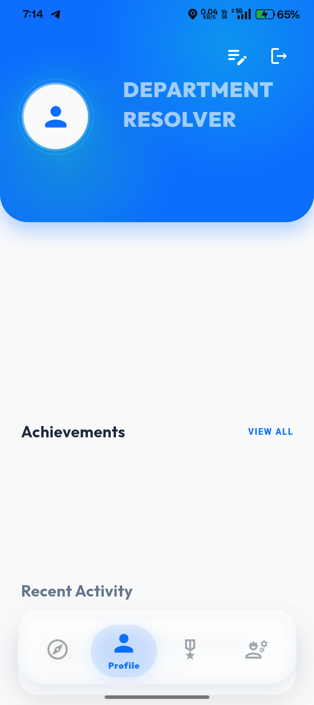

# 🎧 Auracity

[](https://flutter.dev)
[](https://firebase.google.com)
[]()

> **Auracity** is an AI-powered, location-aware application built with Flutter. It seamlessly connects users to their surroundings through dynamic audio experiences, secure authentication, and real-time cloud data.

---

## ✨ Key Features

*   **📍 Location-Aware:** Deep integration with Google Maps SDK for real-time geographic interactivity.
*   **🔐 Secure Authentication:** Seamless user onboarding via Firebase Auth.
*   **🔥 Real-time Cloud Sync:** Robust backend support using Firebase for instant data retrieval.
*   **🤖 AI Insights:** Built-in AI module integrations for smart, tailored content delivery.
*   **📱 Cross-Platform Ready:** Codebase supports Android, iOS, Web, Linux, macOS, and Windows.

---

## 📸 Sneak Peek

| Splash & Onboarding | 
| :---: | 
|  |

---

## 🗂️ Repository Structure

A quick overview of the core files and directories in this project:

*   **`lib/`**: Contains the core Dart code and Flutter UI components.
*   **`assets/`**: Houses all static assets (images, icons, custom fonts).
*   **`firebase.json`**: Firebase configuration and deployment settings.
*   **`android/`**, **`ios/`**, **`web/`**, **`macos/`**, **`windows/`**, **`linux/`**: Native platform-specific configurations and build files.
*   **`auracityinfo.txt` & `prompt.txt`**: Internal project documentation, developer notes, and AI configuration prompts.

---

## 🛠️ Getting Started

### Prerequisites
*   [Flutter SDK](https://docs.flutter.dev/get-started/install) installed on your machine.
*   A code editor like VS Code or Android Studio.
*   Firebase CLI installed globally (`npm install -g firebase-tools`).

### 1. Clone & Install
```bash
# Clone the repository
git clone https://github.com/Ankit-nZ635/Auracity.git

# Navigate into the project
cd Auracity

# Fetch all Flutter dependencies
flutter pub get
```
